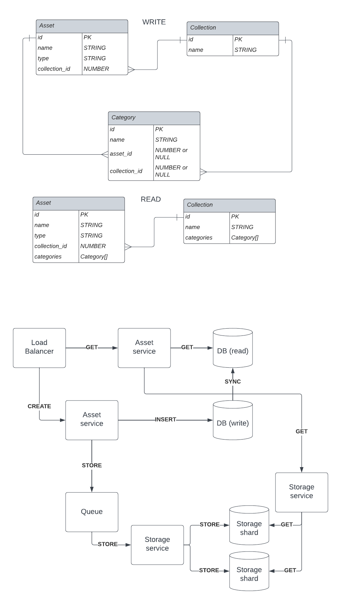

# DemoUp-Cliplister Coding Challenge

Welcome to the DemoUp Cliplister Coding Challenge Backend. 

## Theoretical part

The relationships between assets, categories, and collections are modeled to maintain the necessary associations between the entities.

Separate Databases for Read and Write Operations:
To optimize read and write operations, I have employed different databases for each type of operation. For example, we can use a read-optimized database (e.g., Elasticsearch or Redis) for fast retrieval of data, and a write-optimized database (e.g., PostgreSQL or MongoDB) for efficient storage and handling of incoming writes.

Queue for Long-Time Operations:
Storing big files can be a time-consuming operation, and it can affect the responsiveness of the system. To address this, I have introduced a queue system (e.g., RabbitMQ or Kafka) to offload the file saving process from the main application flow. When a new file is uploaded, the microservice responsible for assets can put the saving task into the queue, and a separate worker service can handle the file-saving process asynchronously. This way, the main application can continue serving other requests without waiting for file-saving to complete.

Sharded File Storage:
With the possibility of having millions of files, we need an efficient way to store and access them. Sharded file storage allows us to divide the files based on some criteria (e.g., filename division) and store them in separate storage nodes. This approach enables better distribution of load and prevents any single node from becoming a bottleneck.

## Setup
* have node, npm and docker installed
* copy `.env.sample` to `.env`
* start db with `docker-compose up -d`
* initialize schema with `npm run init-schema`
  
## Run
* `npm run start` 

## Run tests
* `npm run test:integration` 